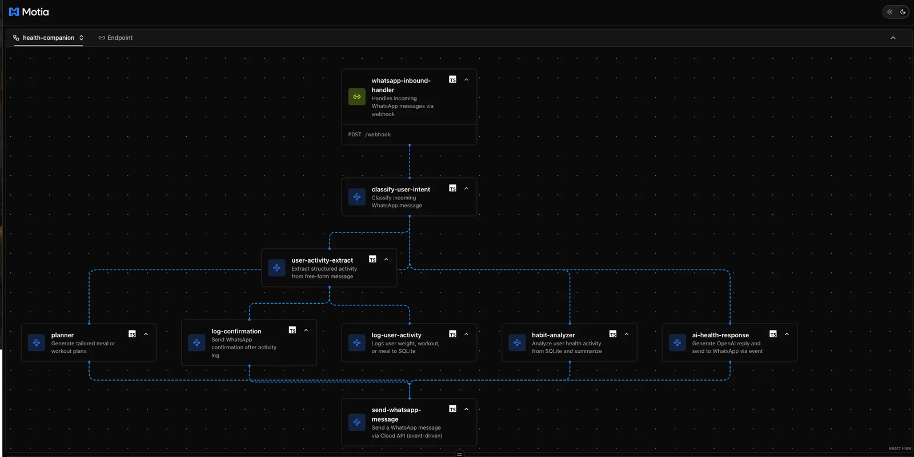
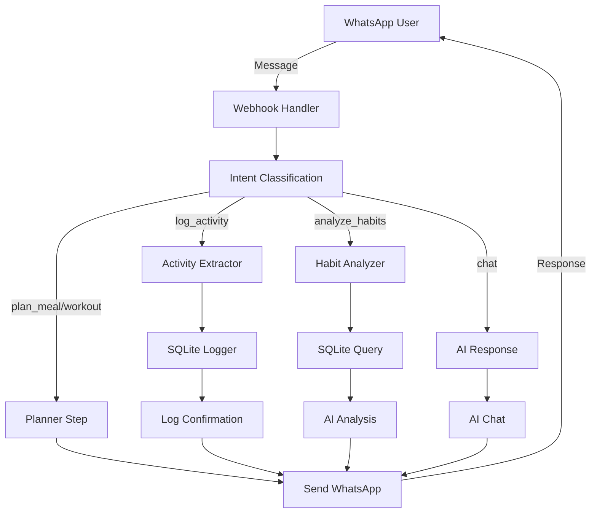
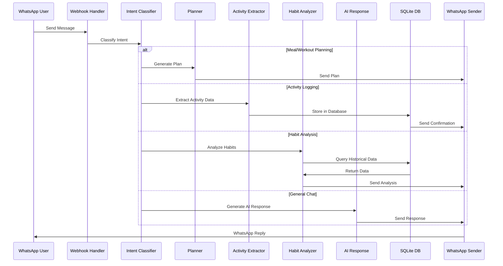

<h3 align="center">
<p align="center">
  <!-- shows in LIGHT mode only -->
  
  <!-- shows in DARK mode only -->
  
</p>
</h3>

<div align="center">

  <h1>🏃‍♂️ AI Health & Fitness Companion</h1>
  <h3>WhatsApp + OpenAI + Motia</h3>

  <p>
    A smart, multi-agent assistant that acts as your daily health coach over WhatsApp generating personalized meal/workout plans, tracking your weight and activities, and providing habit insights powered by OpenAI GPT-4o.
  </p>



  <a href="https://motia.dev">
    
  </a>
  <a href="https://platform.openai.com">
    
  </a>
  <a href="https://developers.facebook.com/docs/whatsapp">
    
  </a>
  
  
</div>


---

## 📱 Demo

**Sample Conversation:**
```
You: "I weighed 72kg today, had a spinach salad for lunch, and did a 20-minute jog."
Bot: "✅ Activity logged! Great job on the jog and healthy meal choice!"

You: "Can you suggest a 2000-calorie vegetarian diet?"
Bot: "Here's a balanced 2000-calorie vegetarian meal plan for you..."

You: "Analyze my recent health habits"
Bot: "Based on your last 10 activities, here are some insights..."
```

## ✨ Key Features

### 🤖 **AI-Powered Health Coaching**
- **Smart Intent Classification**: Automatically understands whether you want to log activity, get meal plans, or analyze habits
- **Personalized Meal Plans**: Custom vegetarian/non-vegetarian meal plans based on calorie requirements
- **Workout Recommendations**: Tailored exercise routines for different fitness goals
- **Health Habit Analysis**: AI-driven insights from your logged activities

### 📊 **Activity Tracking**
- **Weight Monitoring**: Track daily weight changes
- **Meal Logging**: Log meals with automatic parsing from natural language
- **Workout Tracking**: Record exercise activities and duration
- **Persistent Storage**: SQLite database for reliable data retention

### 💬 **WhatsApp Integration**
- **Real-time Messaging**: Instant responses via WhatsApp Cloud API
- **Natural Language Processing**: Chat naturally - no commands needed
- **Webhook Support**: Automatic message processing from WhatsApp

### 🏗️ **Modern Architecture**
- **Event-Driven Design**: Built with Motia's event-driven architecture
- **Streaming Support**: Real-time AI response streaming
- **TypeScript**: Fully typed for better development experience
- **Modular Steps**: Clean separation of concerns with individual Motia steps

---

## 📁 Project Structure

```bash
ai-health-fitness/
├── 📁 prompts/                           # Mustache templates for AI prompts
│   ├── analyze-health.mustache           # Health analysis prompt template
│   ├── classify-intent.mustache          # Intent classification template
│   └── user-activity-extract.mustache   # Activity extraction template
├── 📁 shared/                            # Shared utilities and services
│   └── sqliteLogger.ts                   # SQLite database operations
├── 📁 steps/                            # Motia step definitions
│   ├── 🌐 API Steps (HTTP endpoints)
│   │   ├── whatsapp-webhook.step.ts      # WhatsApp webhook handler
│   │   ├── intent_router_api.step.ts     # Message routing API
│   │   ├── planner-api.step.ts           # Meal/workout planning API
│   │   ├── log-api.step.ts               # Activity logging API
│   │   ├── analyzer-api.step.ts          # Habit analysis API
│   │   └── chat-api.step.ts              # Direct chat API
│   ├── 🎯 Event Steps (Business logic)
│   │   ├── classify_intent.step.ts       # AI-powered intent classification
│   │   ├── extract_health_slots.step.ts  # Structured data extraction
│   │   ├── planner.step.ts               # AI meal/workout plan generation
│   │   ├── log-activity.step.ts          # SQLite activity logging
│   │   ├── log-confirmation.step.ts      # Activity log confirmations
│   │   ├── analyzer.step.ts              # Health habit analysis
│   │   ├── ai-response.step.ts           # AI chat response generation
│   │   └── send-whatsapp.step.ts         # WhatsApp message sending
│   └── 📡 Stream Steps
│       └── conversation.stream.ts        # Conversation state management
├── 📄 Configuration Files
│   ├── package.json                      # Dependencies and scripts
│   ├── motia-workbench.json             # Motia flow configuration
│   ├── types.d.ts                       # Auto-generated TypeScript types
│   └── .env                             # Environment variables
└── 📖 README.md
```

### 🔄 Data Flow Architecture



---

## 🚀 Quick Start Guide

### Prerequisites

- **Node.js** (v18 or higher)
- **npm** or **yarn**
- **OpenAI API Key**
- **Meta Developer Account** (for WhatsApp)
- **ngrok** (for webhook exposure)

### Step 1: 🔑 Get OpenAI API Key

1. Sign up at [OpenAI Platform](https://platform.openai.com/)
2. Navigate to [API Keys](https://platform.openai.com/account/api-keys)
3. Create a new secret key

```env
OPENAI_API_KEY=sk-proj-...
```

### Step 2: 📱 Set Up WhatsApp Cloud API

1. Visit [Meta for Developers](https://developers.facebook.com)
2. Create a new app → Select **"Business"**
3. Add **WhatsApp** product to your app
4. Go to **WhatsApp > Getting Started**
5. Copy the following credentials:
   - **Phone Number ID**
   - **Access Token**
   - **WhatsApp Business Account ID**

### Step 3: ⚙️ Environment Configuration

Create a `.env` file in the project root:

```env
# OpenAI Configuration
OPENAI_API_KEY=sk-proj-your-openai-key-here

# WhatsApp Cloud API Configuration
WHATSAPP_TOKEN=EAAxxxxxxx                    # Access Token from Meta
PHONE_NUMBER_ID=1234567890123456            # Phone Number ID
RECEIVER_PHONE=+1234567890                  # Your test phone number

# Optional: Database Configuration
DB_PATH=./health_data.db                    # SQLite database path
```

### Step 4: 📦 Installation & Setup

```bash
# Install dependencies
npm install

# Initialize the SQLite database
npm run init:db

# Start the development server
npm run dev
```

The server will start on `http://localhost:3000`

### Step 5: 🌐 Expose Your Webhook

In a new terminal, expose your local server:

```bash
# Install ngrok if you haven't already
npm install -g ngrok

# Expose port 3000
ngrok http 3000
```

Copy the HTTPS URL (e.g., `https://abc123.ngrok.io`)

### Step 6: 🔗 Configure WhatsApp Webhook

1. Go back to your Meta Developer Console
2. Navigate to **WhatsApp > Configuration**
3. Set the webhook URL: `https://your-ngrok-url.ngrok.io/webhook`
4. Set the verify token (any string you choose)
5. Subscribe to **messages** webhook field

### Step 7: 🧪 Test Your Bot

Send these messages to your WhatsApp test number:

#### 📊 **Activity Logging**
```
I weighed 72kg today, had a spinach salad for lunch, and did a 20-minute jog.
```

#### 🍽️ **Meal Planning**
```
Can you suggest a 2000-calorie vegetarian diet?
I need a high-protein meal plan for muscle building
```

#### 💪 **Workout Planning**
```
I need a stamina workout plan for 30 minutes
Create a strength training routine for beginners
```

#### 📈 **Habit Analysis**
```
Analyze my recent health habits
How can I improve my diet from last week?
```

#### 💬 **General Chat**
```
What's the best time to exercise?
How much water should I drink daily?
```

---

## 🏗️ Technical Architecture

### Event-Driven Flow



### Core Components

#### 🎯 **Intent Classification System**
- Uses OpenAI GPT-4o-mini to understand user intent
- Supports 4 main intents: `plan_meal`, `plan_workout`, `log_activity`, `analyze_habits`
- Fallback to general chat for unrecognized intents

#### 📊 **Data Processing Pipeline**
- **Structured Extraction**: Converts natural language to JSON using OpenAI's structured output
- **SQLite Storage**: Persistent storage for weight, meals, and workouts
- **Mustache Templates**: Reusable prompt templates for consistent AI interactions

#### 🔄 **Event System**
- **Asynchronous Processing**: All operations are event-driven for scalability
- **Loose Coupling**: Steps communicate via events, not direct calls
- **Error Resilience**: Failed steps don't break the entire flow

---

## 🛠️ Development

### Available Scripts

```bash
# Development
npm run dev              # Start development server with hot reload
npm run dev:debug        # Start with debug logging enabled

# Database
npm run init:db          # Initialize SQLite database schema

# Configuration
npm run generate:config  # Generate Motia configuration files
```

### Adding New Features

1. **Create a new step**: Add a new `.step.ts` file in the `steps/` directory
2. **Define events**: Specify what events your step subscribes to and emits
3. **Update types**: Run the development server to auto-generate TypeScript types
4. **Test the flow**: Use the Motia workbench to visualize and test your changes

### Database Schema

```sql
CREATE TABLE tracker (
  id INTEGER PRIMARY KEY AUTOINCREMENT,
  user TEXT NOT NULL,
  weight TEXT,
  workout TEXT,
  meal TEXT,
  timestamp DATETIME DEFAULT CURRENT_TIMESTAMP
);
```

---

## 🐛 Troubleshooting

### Common Issues

| Problem | Symptom | Solution |
|---------|---------|----------|
| **Webhook not receiving messages** | No logs in console when sending WhatsApp messages | • Verify ngrok is running<br>• Check webhook URL in Meta console<br>• Ensure webhook URL ends with `/webhook` |
| **OpenAI API errors** | "Invalid API key" or rate limit errors | • Verify `OPENAI_API_KEY` in `.env`<br>• Check API quota and billing<br>• Ensure key has GPT-4o access |
| **WhatsApp messages not sending** | Bot receives but doesn't reply | • Verify `WHATSAPP_TOKEN` and `PHONE_NUMBER_ID`<br>• Check phone number format (+country code)<br>• Review Meta app permissions |
| **Database errors** | Activity logging fails | • Run `npm run init:db`<br>• Check file permissions<br>• Verify SQLite installation |
| **Intent classification issues** | Bot doesn't understand messages | • Check prompt templates in `prompts/`<br>• Review classification logs<br>• Test with simpler messages |

### Debug Mode

Enable detailed logging:

```bash
npm run dev:debug
```

This will show:
- Event emissions and subscriptions
- OpenAI API requests/responses
- Database operations
- WhatsApp API calls

### Health Check Endpoints

Test your setup with these endpoints:

```bash
# Test message routing
curl -X POST http://localhost:3000/intent \
  -H "Content-Type: application/json" \
  -d '{"user": "test", "message": "I ran 5km today"}'

# Test meal planning
curl -X POST http://localhost:3000/plan \
  -H "Content-Type: application/json" \
  -d '{"user": "test", "type": "meal", "prompt": "2000 calorie diet"}'

# Test activity logging
curl -X POST http://localhost:3000/log \
  -H "Content-Type: application/json" \
  -d '{"user": "test", "weight": "70kg", "meal": "salad"}'
```


## 🤝 Contributing

We welcome contributions! Here's how to get started:

### Development Setup

1. **Fork & Clone**
   ```bash
   git clone https://github.com/your-username/motia-examples.git
   cd motia-examples/examples/ai-health-fitness
   ```

2. **Install Dependencies**
   ```bash
   npm install
   ```

3. **Set Up Environment**
   - Copy `.env.example` to `.env`
   - Add your API keys and configuration

4. **Run Tests**
   ```bash
   npm test
   npm run lint
   ```

### Contribution Guidelines

- **Code Style**: Follow the existing TypeScript/JavaScript patterns
- **Commit Messages**: Use conventional commit format (`feat:`, `fix:`, `docs:`, etc.)
- **Testing**: Add tests for new features
- **Documentation**: Update README for any new functionality

### Areas for Contribution

- 🏥 **Health Integrations**: Add support for fitness trackers, health apps
- 🍎 **Nutrition Features**: Calorie counting, macro tracking, recipe suggestions
- 📊 **Analytics**: Advanced health insights, progress visualization
- 🌍 **Internationalization**: Multi-language support
- 🧪 **Testing**: Unit tests, integration tests, E2E tests
- 📱 **UI/UX**: Web dashboard, mobile app integration

---

## 📄 License

This project is licensed under the **MIT License** - see the [LICENSE](../../LICENSE) file for details.

---

## 🙏 Acknowledgments

- **[Motia](https://motia.dev)** - Event-driven workflow platform
- **[OpenAI](https://openai.com)** - AI-powered natural language processing
- **[Meta WhatsApp Business API](https://developers.facebook.com/docs/whatsapp)** - Messaging infrastructure
- **[SQLite](https://sqlite.org)** - Lightweight database engine

---

## 📞 Support

- **Documentation**: [Motia Docs](https://docs.motia.dev)
- **Community**: [Discord](https://discord.gg/motia)
- **Issues**: [GitHub Issues](https://github.com/motia-examples/issues)
- **Email**: support@motia.dev

---

<div align="center">
  <p>
    <strong>Built with ❤️ using Motia</strong>
  </p>
  <p>
    <a href="#readme-top">↑ Back to top</a>
  </p>
</div>


