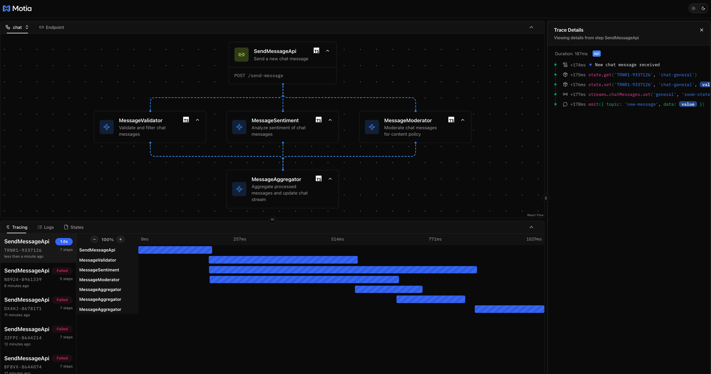

# 🚀 Motia Framework: Real-Time Chat Application

A comprehensive demonstration of **real-time chat functionality** with **asynchronous message processing** using the [Motia Framework](https://github.com/MotiaDev/motia) - showcasing how complex event-driven chat systems can be built with elegant simplicity.


## 🎯 Why This Example Matters

Modern chat applications require **real-time messaging** with sophisticated processing capabilities. Traditional approaches often involve complex WebSocket management, message queuing, and synchronization logic. **Motia transforms this complexity into simple, declarative workflows** that are:

- ✅ **Type-Safe**: Full TypeScript support with Zod validation
- ✅ **Event-Driven**: Clean pub/sub architecture for message flow
- ✅ **Real-Time**: Live message streaming with state updates
- ✅ **Scalable**: Parallel message processing without manual thread management
- ✅ **Maintainable**: Self-documenting workflow steps

## 🏗️ Architecture Overview

This example demonstrates a **real-time chat system** that processes messages through multiple concurrent processors:

### 🔄 Event Flow

1. **Send Message API** (`/send-message`) receives chat messages
2. **New Message Topic** broadcasts to all processors simultaneously
3. **Three Processors** execute concurrently:
   - Message validation (200ms processing time)
   - Sentiment analysis (500ms processing time)  
   - Content moderation (300ms processing time)
4. **Message Aggregator** merges results and updates chat history
5. **Chat Stream** provides real-time message updates to all clients

## 🚀 Quick Start

### Prerequisites
- Node.js 18+
- npm or yarn

### Installation & Setup

```bash
# Clone the repository
git clone https://github.com/MotiaDev/motia-examples.git
cd motia-examples/chat-agent

# Install dependencies
npm install

# Start the development server
npm run dev
```

### 🧪 Testing the Chat System

1. **Open the Motia Workbench**: http://localhost:3000
2. **Navigate to Endpoints** tab
3. **Send chat messages**:

```bash
# Using curl
curl -X POST http://localhost:3000/send-message \
  -H "Content-Type: application/json" \
  -d '{
    "message": "Hello everyone! This is an amazing chat system!",
    "username": "testuser",
    "roomId": "general"
  }'
```

4. **Monitor Results**:
   - **Logs Tab**: See all three processors start simultaneously
   - **States Tab**: View message processing results
   - **Streams Tab**: Watch real-time chat message updates

## 📁 Project Structure

```
chat-agent/
├── steps/
│   ├── send-message-api.step.ts       # Chat message API endpoint
│   ├── message-validator.step.ts      # Message validation processor
│   ├── message-sentiment.step.ts      # Sentiment analysis processor
│   ├── message-moderator.step.ts      # Content moderation processor
│   ├── message-aggregator.step.ts     # Message aggregation
│   └── chat-messages.stream.ts        # Real-time chat stream
├── types.d.ts                          # TypeScript definitions
└── package.json                        # Dependencies
```

## 🔧 How It Works

### 1. **Chat Message API**
The workflow starts with an API endpoint that accepts chat messages and triggers parallel processing:

```typescript
// From send-message-api.step.ts
export const config: ApiRouteConfig = {
  type: 'api',
  method: 'POST',
  path: '/send-message',
  emits: ['new-message'],  // Broadcasts to all processors
  bodySchema: z.object({ 
    message: z.string().min(1, 'Message content is required'),
    username: z.string().min(1, 'Username is required'),
    roomId: z.string().optional().default('general')
  })
}
```

### 2. **Parallel Message Processing Steps**
Each processor subscribes to the same topic for **true parallel execution**:

```typescript
// Pattern used in validator, sentiment, moderator steps
export const config: EventConfig = {
  type: 'event',
  subscribes: ['new-message'],      // Same topic = parallel execution
  emits: ['processed-message'],     // Results sent to aggregator
  input: z.object({ 
    messageId: z.string(),
    message: z.string(),
    username: z.string(),
    roomId: z.string(),
    timestamp: z.string()
  })
}
```

**Processing Details:**
- **Message Validation** (200ms): Validates content and filters banned words
- **Sentiment Analysis** (500ms): Analyzes positive/negative/neutral sentiment
- **Content Moderation** (300ms): Moderates inappropriate content and removes links

### 3. **Real-Time Chat Streaming**
```typescript
// From chat-messages.stream.ts
export const config: StateStreamConfig = {
  name: 'chatMessages',
  schema: z.object({
    roomId: z.string(),
    messages: z.array(z.object({
      messageId: z.string(),
      message: z.string(),
      username: z.string(),
      timestamp: z.string(),
      sentiment: z.string().optional(),
      isModerated: z.boolean().optional()
    })),
    totalMessages: z.number(),
    lastActivity: z.string()
  })
}
```

### 4. **Intelligent Message Aggregation**
The aggregator waits for all processing results and updates the chat:

```typescript
// From message-aggregator.step.ts
const expectedProcessing = ['validation', 'sentiment', 'moderation']
const isComplete = expectedProcessing.every(key => completedProcessing.includes(key))

if (isComplete && validation.isValid && !moderation.shouldBlock) {
  // Add message to chat stream
  currentChat.messages.push(newMessage)
  await streams.chatMessages.set(traceId, roomId, currentChat)
}
```

## 🎨 Key Features Demonstrated

### ⚡ **True Parallel Message Processing**
- Multiple steps subscribe to the same topic
- All processors start **simultaneously**
- No manual thread management required
- **Event-driven coordination**

### 📊 **Real-Time Chat Updates**
- Stream-based message updates
- Live chat monitoring in workbench
- **Instant message delivery**
- State persistence across chat sessions

### 🔄 **Intelligent Message Aggregation**
- Processing results collected as they complete
- **Completion detection** logic
- Message filtering and moderation
- **Type-safe** message handling

### 🛡️ **Content Safety & Validation**
- **Message validation** with banned word filtering
- **Sentiment analysis** for message tone
- **Content moderation** with link removal
- **Real-time safety checks**

### 🎯 **Type Safety Throughout**
- **Zod schemas** for input validation
- **TypeScript definitions** for all handlers
- **Compile-time** error detection
- **Runtime** validation

## 🌟 Why Motia is Amazing

### **Before Motia** (Traditional Approach)
```javascript
// Complex WebSocket management, message queuing, synchronization
const io = require('socket.io')(server)
io.on('connection', (socket) => {
  socket.on('message', async (data) => {
    // Manual validation, processing, broadcasting...
    const validated = await validateMessage(data)
    const sentiment = await analyzeSentiment(data)
    const moderated = await moderateContent(data)
    // Complex state management and real-time updates...
  })
})
```

### **With Motia** (Declarative Approach)
```typescript
// Simple event subscription = automatic parallel processing
export const config: EventConfig = {
  subscribes: ['new-message'],  // That's it!
  emits: ['processed-message']
}
```

## 🔍 Example Output

### Send a Message

**POST** `/send-message`

```json
{
  "message": "Hello everyone!",
  "username": "testuser",
  "roomId": "general"  // Optional: Defaults to "general" if not provided
}
```

### Parallel Processing Logs
```
[10:20:20] New chat message received (messageId: msg-1748947169-abc123)
[10:20:20] Validating message (messageId: msg-1748947169-abc123)
[10:20:20] Analyzing message sentiment (messageId: msg-1748947169-abc123)  
[10:20:20] Moderating message content (messageId: msg-1748947169-abc123)
[10:20:20] Message validation completed (200ms)
[10:20:21] Message moderation completed (300ms)
[10:20:21] Message sentiment analysis completed (500ms)
[10:20:21] Message added to chat (roomId: general, totalMessages: 1)
```

### Chat Message Response
```json
{
  "success": true,
  "messageId": "msg-1748947169-abc123",
  "timestamp": "2024-01-30T10:20:20.000Z",
  "message": {
    "id": "msg-1748947169-abc123",
    "content": "Hello everyone! This is an amazing chat system!",
    "username": "testuser",
    "roomId": "general",
    "timestamp": "2024-01-30T10:20:20.000Z"
  }
}
```

### Final Chat Stream Update
```json
{
  "roomId": "general",
  "messages": [
    {
      "messageId": "msg-1748947169-abc123",
      "message": "Hello everyone! This is an amazing chat system!",
      "username": "testuser",
      "timestamp": "2024-01-30T10:20:20.000Z",
      "sentiment": "positive",
      "isModerated": false,
      "flags": []
    }
  ],
  "totalMessages": 1,
  "lastActivity": "2024-01-30T10:20:20.000Z"
}
```

## 🚀 Extending This Example

### Add More Message Processors
```typescript
// Just create a new step that subscribes to 'new-message'
export const config: EventConfig = {
  name: 'LanguageDetector',
  subscribes: ['new-message'],
  emits: ['processed-message']
}
```

### Custom Chat Features
```typescript
// Add emoji detection, mention handling, etc.
export const config: EventConfig = {
  name: 'EmojiProcessor',
  subscribes: ['new-message'],
  emits: ['processed-message']
}
```

### Multi-Room Support
```typescript
// Already built-in! Just use different roomId values
{
  "message": "Hello team!",
  "username": "developer",
  "roomId": "development"
}
```

## 🤝 Contributing

1. Fork the repository
2. Create your feature branch (`git checkout -b feature/amazing-processor`)
3. Add your parallel processor step
4. Update the aggregator to handle new results
5. Test with the workbench
6. Submit a pull request

## 📚 Learn More

- **Motia Framework**: https://github.com/MotiaDev/motia
- **Documentation**: [Motia Docs](https://www.motia.dev/docs)
- **Examples**: [More Motia Examples](https://github.com/MotiaDev/motia-examples)

## 🎯 Conclusion

This example showcases how **Motia transforms complex real-time chat systems** into elegant, maintainable workflows. With just a few declarative steps, you get:

- ⚡ **Automatic parallel message processing**
- 📊 **Real-time chat streaming** 
- 🔄 **Intelligent message aggregation**
- 🛡️ **Complete content safety**
- 🎨 **Visual workflow monitoring**

**Motia makes the complex simple** - turning what would be hundreds of lines of WebSocket and message queue management code into clean, declarative workflow steps that are easy to understand, test, and maintain.

---

**Built with ❤️ using [Motia Framework](https://github.com/MotiaDev/motia)**
