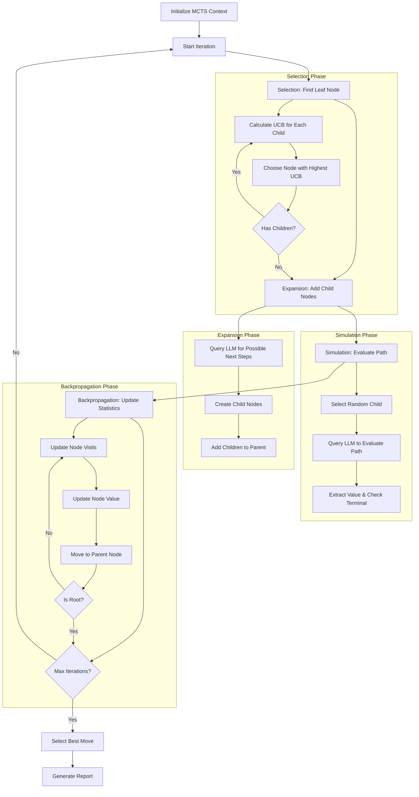

# Code Review Agent

## CLI Usage

The Code Review Agent can be run in three different ways:

```bash
# 1. Run with Motia event system (requires motia server)
npm run dev             # Start Motia server in one terminal
npm run review          # Run the code review in another terminal

# 2. Run the test version (doesn't require motia server)
npm run test-review     # Quick test of the workflow with mock data

# 3. Run the standalone version (recommended)
npm run standalone-review  # Analyze repo and generate full report
```

All commands will output a Review.md file in the project directory with a comprehensive code analysis.

### Command-line Options

The standalone review script accepts the following options:

```bash
npm run standalone-review -- --requirements "Your custom requirements" --outputPath "./custom-path.md"
```

This limited demonstration checks the last 14 commits of the git history of the current directory against the requirements.

## Workflow Visualization


## Project Description

This project implements a Code Review flow to address the poor performance of Claude Code and other LLMs in real world code review scenarios. [Research suggests](doc/reasoning-models.pdf) Claude's lack of branched reasoning may be partially to blame, and outlines potential ways to enhance these capabilities. We implement a "monte carlo tree search"-based reasoning model as described in [this paper](doc/MCTS.pdf) to explore various thinking styles with human feedback, fast semantic search provided by [Probe](https://github.com/buger/probe) to help manage context through recursive iterations, and output an implementation plan for resolving the code review comments. The output plan should be sufficient context for an AI Implementation Agent to commit the changes to the codebase.

**Use cases:** Pre-reviewing code before submission to team, refactoring code before beginning new work.

## Implementation Overview

Our implementation follows the Monte Carlo Tree Search algorithm to enable more comprehensive and thoughtful code reviews:

1. **Controller**: Initializes the MCTS tree and manages the overall workflow
2. **Selection**: Uses UCB1 algorithm to balance exploration and exploitation when selecting nodes to expand
3. **Expansion**: Generates potential reasoning paths using LLM-generated suggestions
4. **Simulation**: Evaluates the potential paths for quality and relevance
5. **Backpropagation**: Updates node statistics based on simulation results
6. **Best Path Selection**: Chooses the most promising reasoning path based on node visits and values
7. **Report Generation**: Creates comprehensive markdown reports with Mermaid diagrams

The system is built using Motia, an event-driven workflow framework, which allows for a modular, loosely-coupled architecture.

## Major Features and Improvements

- **Memory Management**: Implemented 1MB size limits for git diffs to prevent excessive memory usage
- **Claude Integration**: Added flexible mocking capabilities for Claude API calls to enable testing
- **Event Chaining**: Built a complete event-driven workflow with proper error handling
- **Modular Architecture**: Separated all MCTS phases into independent, testable steps
- **Visualization**: Generated comprehensive markdown reports with Mermaid diagrams
- **CLI Interface**: Created multiple interfaces for running the code review process
- **Test Coverage**: Added integration and unit tests for all components

### Step Flow


## Project Structure

```
code-review/
├── scripts/              # CLI Scripts
│   ├── cli-review.js     # Motia event-based script
│   ├── test-review.js    # Test script with mock data
│   └── run-standalone-review.js  # Standalone analysis script
├── steps/
│   ├── code-review/      # Core MCTS implementation
│   │   ├── backPropogate.step.ts
│   │   ├── controller.step.ts
│   │   ├── expandNode.step.ts
│   │   ├── markdownReport.step.ts
│   │   ├── reviewRequest.api.step.ts
│   │   ├── selectBestMove.step.ts
│   │   ├── selectNode.step.ts
│   │   └── simulate.step.ts
│   └── shared/           # Shared utilities and agents
│       ├── agents/       # Claude and other LLM integration
│       └── utils/        # Repository handling and utilities
├── doc/                  # Documentation and resources
├── jest.config.js
├── package.json
├── README.md
└── tsconfig.json
```

## Potential Future Improvements

1. External (webhook & API based) reflection step with timeout enforcement
2. Optional human-in-the-loop reflection step (full automation)
3. Create a higher order composition that uses this agent along with an implementation agent to handle gitops and automate the developer PR workflow
4. Implement persistent (in-repo) memory for learning and documenting coding standards enforced during review phase, but not yet documented in codebase
5. Optimize context management and compression
6. Improve and optimize coroutines and prompts in reasoning steps
7. Integrate with GitHub/GitLab APIs for PR-based reviews
8. Add support for more granular code analysis (function/class level)
