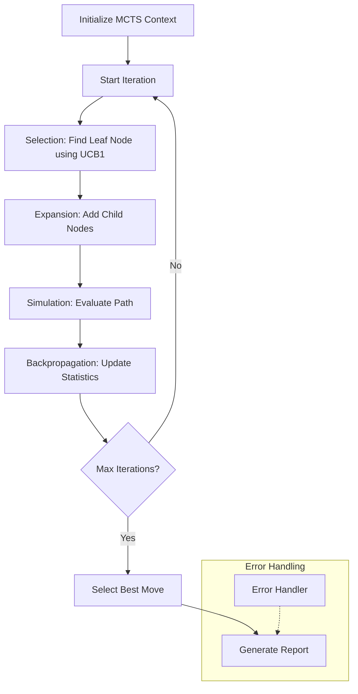

# Code Review Agent

## CLI Usage

During development, the agent will use mock data for its LLM responses unless you set the environment variable `SPEND=true` in your environment. You must also provide a `.env` file for the API keys with the following:

```sh
OPENAI_API_KEY=sk-...
ANTHROPIC_API_KEY=sk-...
OPENROUTER_API_KEY=sk-...
```

The agent server must be running before you can run the code review.

```bash
SPEND=true npm run dev  # Start Motia server with LLM spending enabled
npm run review          # Run the code review process
```

The `review` command will initiate a code review analysis of the current repository and generate a `Review.md` file containing the findings. In this version, the agent performs a simple MCTS loop to evaluate the best approach for evaluating the code, and generates a report illustrating its reasoning.

This version focuses on a rewrite of agent code into python. The next version will re-introduce analytical code review expansion steps, generating a report with useful advice and analysis (e.g. a report card on how well the target commits it reviews satisfy the requirements it was given, and how to improve).

### Command-line Options

The CLI interface supports various configuration options:

```bash
npm run review -- --repository="/path/to/repo" --requirements="Focus on security and performance issues"

npm run review -- --repository="https://github.com/myco/myrepo.git" --branch="issue-100" --requirements="Fix logging issues when running with the --verbose flag"
```

Available options:
- `--repository`: Path or URL to the git repository (default: current directory)
- `--branch`: Git branch to review (default: current branch)
- `--requirements`: Custom requirements for the code review
- `--depth`: The depth of the review analysis (default: 2)
- `--reviewStartCommit`: Starting commit for review range
- `--reviewEndCommit`: Ending commit for review range (default: HEAD)
- `--reviewMaxCommits`: Maximum number of commits to review (default: 14)
- `--maxIterations`: Maximum iterations for the MCTS process (default: 6)
- `--outputPath`: Custom path for the review output

## Testing

The code review agent can be tested using the `npm test` command. This will run the tests for both the Python and TypeScript components.

## REST API

The Code Review Agent can also be triggered via a RESTful API endpoint:

```bash
curl -X POST http://localhost:3000/api/review \
  -H "Content-Type: application/json" \
  -d '{
    "repository": "/path/to/repo",
    "branch": "main",
    "requirements": "Focus on security issues",
    "depth": 2,
    "maxIterations": 10
  }'
```

## Project Description

This project implements a Code Review flow to enhance code analysis through a branched reasoning approach. Research suggests traditional LLMs lack sufficient branched reasoning capabilities, so we implement a "Monte Carlo Tree Search" (MCTS) based reasoning model to explore various thinking styles. This is combined with semantic search powered by [Probe](https://github.com/buger/probe) for efficient context management through recursive iterations.

**Use cases:** Pre-reviewing code before team submission, refactoring code before beginning new work.

## Implementation Overview

Our implementation follows the Monte Carlo Tree Search algorithm:

1. **Controller**: Initializes the MCTS tree and manages the overall workflow
2. **Selection**: Uses UCB1 algorithm to balance exploration and exploitation when selecting nodes
3. **Expansion**: Generates potential reasoning paths using LLM-generated suggestions
4. **Simulation**: Evaluates the potential paths for quality and relevance
5. **Backpropagation**: Updates node statistics based on simulation results
6. **Best Path Selection**: Chooses the most promising reasoning path based on node visits and values
7. **Report Generation**: Creates comprehensive markdown reports with Mermaid diagrams

The system is built using Motia, an event-driven workflow framework, enabling a modular, loosely-coupled architecture with a hybrid approach using both Python and TypeScript.


### Step Flow



## Project Structure

```
code-review/
├── scripts/                # CLI Scripts
│   ├── cli.js              # Enhanced CLI interface
│   └── setup_python_env.sh # Python environment setup
├── steps/
│   ├── code_review/        # Core MCTS implementation
│   │   ├── controller.step.py        # Python implementation of controller
│   │   ├── expand_node.step.py       # Python implementation of expansion
│   │   ├── select_node.step.py       # Python implementation of selection
│   │   ├── simulate.step.py          # Python implementation of simulation
│   │   ├── backPropogate.step.ts     # TypeScript implementation of backpropagation
│   │   ├── selectBestMove.step.ts    # TypeScript implementation of best move selection
│   │   ├── errorHandler.step.ts      # Error handling and recovery
│   │   ├── markdownReport.step.ts    # Report generation
│   │   └── reviewRequest.api.step.ts # Authoritative API endpoint
│   └── shared/              # Shared utilities and agents
│       ├── agents.py        # LLM integration
│       ├── actions.py       # Common actions
│       ├── repositories.py  # Repository management
│       ├── tools.py         # Utility tools
│       ├── models.py        # Python data models
│       ├── models.ts        # TypeScript data models
│       └── utils/           # Additional utilities
│           ├── repository.ts # Repository handling
│           └── markdown.ts   # Markdown processing
├── doc/                     # Documentation and resources
└── README.md
```

## Future Roadmap

1. Human-in-the-loop reflection with timeout enforcement
2. Higher-order composition with implementation agents for end-to-end automation
3. Persistent in-repo memory for learning coding standards
4. Integration with GitHub/GitLab APIs for PR-based reviews
5. Support for more granular code analysis at function/class level
6. Advanced report visualization with interactive components
7. Configurable reasoning strategies beyond MCTS
