# Code Review Agent
This project seeks to implement a Code Review flow to address the poor performance of Claude Code and other LLMs in real world code review scenarios. [Research suggests](doc/reasoning-models.pdf) Claude's lack of branched reasoning may be partially to blame, and outlines potential ways to enhance these capabilities. We implement a "monte carlo tree search"-based reasoning model as described in [this paper](doc/MCTS.pdf) to explore various thinking styles with human feedback, fast semantic search provided by [Probe](https://github.com/buger/probe) to help manage context through recursive iterations, and output an implementation plan for resolving the code review comments. The output plan should be sufficient context for an AI Implementation Agent to commit the changes to the codebase.

**Use cases:** Pre-reviewing code before submission to team, refactoring code before beginning new work.

**Agent Flow: Review**
Inputs: Code, Requirements, Developer history, PR history
Outputs: Plan.md
Brief: Collects local context about code branch to generate an array of plan parts from code review steps. Aggregates plan parts into a single plan, output in markdown.

**Steps:**
- Review(requirements, repo, branch, sinceWhen)
    - Emits: ReviewContext review.requested
    - Subscribes: APIRequest
- Analyze(context, depth)
    - Emits: Problem review.problemFound | PlanPart review.planPart
    - Subscribes: ReviewContext review.requested
- Suggest(context, maxThoughtChains)
    - Emits: Suggestion review.suggestion
    - Subscribes: Problem review.problemFound
- Reflect(context, suggestion)
    - Emits: Argument review.argument | ReviewContext review.requested | PlanPart review.planPart (if reflection makes demand for plan part)
    - Subscribes: Suggestion review.suggestion | CounterArgument review.counter
- Consider(context, suggestion, argument)
    - Emits: CounterArgument review.counterArgument
    - Subscribes: Argument review.argument | Suggestion review.suggestion
- Compose(planPart)
    - Emits: Plan review.planComposed
    - Subscribes: PlanPart[] review.planPart
- Plan(plan)
    - Emits: Plan review.done (Plan.md)
    - Subscribes: Plan review.planComposed

### Flow

```mermaid
graph TD
    Review[🔍 Phase: Review
     Outputs suggested edits plan with dev collaboration and recursive logic steps]
    Code[📋 Code] --> Review
    Requirements[📋 Requirements] --> Review
    Commit[📋 Commit Log] --> Review
    Review -- Context --> Analyze[🧠 Step: Analyze] -- depth > 0 --> Suggest[💡 Step: Suggest] --> Reflect[🤔 Step: Reflect] -- Argue --> Consider[⚖️ Step: Consider] -- Counter --> Reflect
    Analyze -- PlanPart\[\] --> Review
    Reflect -- Accept (depth -1) --> Analyze
    Reflect -.-> User[👨 User] -.-> Reflect
    Consider --> Drop>🗑️ Drop]
    Analyze -- depth == 0 --> PlanPart[🧩 Plan Part]
    Reflect -- Reject --> Drop
```


# Potential future improvements:
1. Optional human-in-the-loop
2. Create a higher order composition that uses this agent along with an implementation agent to handle gitops and automate the developer PR workflow
3. Implement persistent (in-repo) memory for learning and documenting coding standards enforced during review phase, but not yet documented in codebase
4. Optimize context management and compression
5. Improve and optimize coroutines and prompts in reasoning steps

# Project Structure
```
code-review/
├── steps/
│   ├── review/
│   │   ├── analyze.step.ts
│   │   ├── consider.step.ts
│   │   ├── compose.step.ts
│   │   ├── plan.step.ts
│   │   ├── reflect.step.ts
│   │   └── suggest.step.ts
│   └── shared/
│       ├── types/
│       ├── utils/
│       ├── context.ts
│       ├── reasoning.ts
│       └── index.ts
├── CLAUDE.md
├── jest.config.js
├── package.json
├── README.md
└── tsconfig.json
```