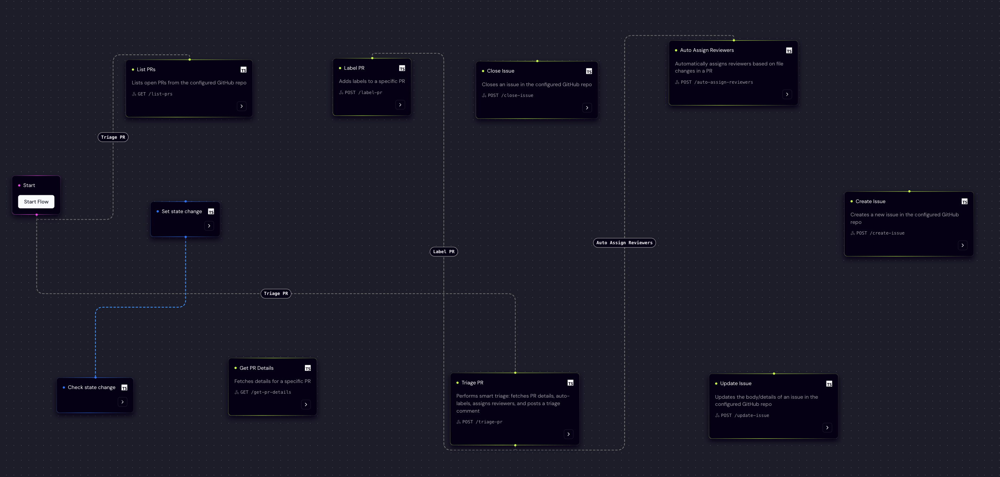
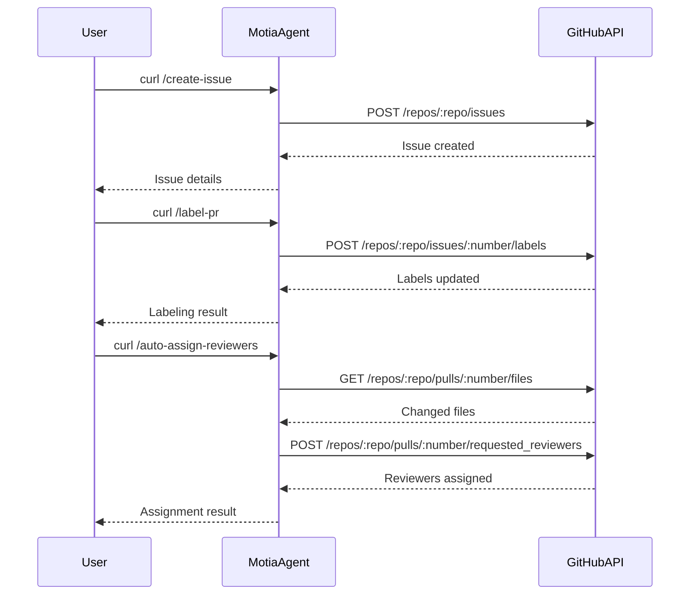

# GitHub PR Agent

<div align="center">
  
  
  
</div>

<div align="center" style="display: flex; justify-content: center; align-items: center; gap: 40px;">
  
  
</div>

## 🔍 Overview

The GitHub PR Agent is a powerful tool built with the Motia framework that helps streamline code review, automate issue management, and enhance collaboration in software development teams. It provides intelligent automation for managing GitHub Pull Requests and Issues, making the development workflow more efficient and consistent.



## ✨ Features

- **PR Management**
  - List and analyze open PRs
  - Get detailed PR information
  - Auto-label PRs based on content
  - Smart PR triage with automated actions

- **Issue Management**
  - Create and update issues
  - Close issues programmatically
  - Add labels and assignees
  - Automated issue tracking

- **Review Automation**
  - Auto-assign reviewers based on file patterns
  - Team-based reviewer assignment
  - Smart triage with automated comments
  - Review status tracking

- **Workflow Integration**
  - RESTful API endpoints
  - Event-driven architecture
  - Visual workflow design
  - Built-in logging and monitoring

## 🔄 Workflow

1. **PR Creation**: New PR is created in GitHub
2. **Auto Triage**: System analyzes PR content and metadata
3. **Label Assignment**: Smart labeling based on content analysis
4. **Reviewer Assignment**: Automatic assignment of relevant reviewers
5. **Team Notification**: Notify affected teams about changes
6. **Status Tracking**: Monitor PR status and review progress
7. **Issue Management**: Create and manage related issues
8. **Workflow Automation**: Execute custom automation steps

## 🔧 Implementation Details

### API Endpoints

- `list-prs`: List all open PRs
- `get-pr-details`: Get detailed PR information
- `label-pr`: Add labels to a PR
- `auto-assign-reviewers`: Smart reviewer assignment
- `create-issue`: Create new issues
- `close-issue`: Close existing issues
- `update-issue`: Update issue details
- `triage-pr`: Perform comprehensive PR triage

### Technical Components

- **Event System**: Motia's event-driven architecture for workflow automation
- **GitHub Integration**: Robust GitHub API integration with error handling
- **Smart Analysis**: Content-based analysis for PR and issue management
- **Team Management**: Intelligent team-based reviewer assignment
- **UI Components**: Simple web interface for monitoring and control

## 🚀 Quick Start

### Prerequisites

- Node.js 18 or higher
- pnpm (recommended) or npm
- GitHub Personal Access Token with repo scope

### Environment Setup

1. Clone this repository:
   ```bash
   git clone https://github.com/swarna1101/github-pr-agent.git
   cd github-pr-agent
   ```

2. Install dependencies:
   ```bash
   pnpm install
   ```

3. Configure environment:
   - Copy `.env.example` to `.env`
   - Add your GitHub token and repo:
     ```env
     GITHUB_TOKEN=your_github_token_with_repo_or_issues_scope
     GITHUB_REPO=owner/repo-name
     ```

4. Start the server:
   ```bash
   pnpm dev
   ```

## 🌐 API Usage

### List Open PRs
```bash
curl http://localhost:3000/list-prs
```

### Get PR Details
```bash
curl "http://localhost:3000/get-pr-details?number=123"
```

### Label a PR
```bash
curl -X POST http://localhost:3000/label-pr \
  -H "Content-Type: application/json" \
  -d '{"number":123,"labels":["triage","needs-review"]}'
```

### Auto Assign Reviewers
```bash
curl -X POST http://localhost:3000/auto-assign-reviewers \
  -H "Content-Type: application/json" \
  -d '{"number":123}'
```

### Create an Issue
```bash
curl -X POST http://localhost:3000/create-issue \
  -H "Content-Type: application/json" \
  -d '{"title":"Test Issue","body":"Issue description","labels":["bug"]}'
```

### Triage PR
```bash
curl -X POST http://localhost:3000/triage-pr \
  -H "Content-Type: application/json" \
  -d '{"number":123}'
```

## 📊 Workflow Diagram



## 🤖 Why Motia?

- **Visual Automation:** Design workflows visually
- **Low-Code:** Add steps with minimal code
- **Extensible:** Easy integration with new tools
- **Observability:** Built-in logging and monitoring
- **Fast Prototyping:** Build and test quickly

## 🔮 Future Enhancements

- **Auto-label PRs** based on content or author
- **PR review assignment** automation
- **Slack/Discord notifications** for PR/issue events
- **Scheduled/recurring** GitHub actions
- **Custom triggers** for PR/issue events
- **CI/CD integration**
- **Webhook support** for real-time events

## 🙏 Acknowledgements

- [Motia](https://motia.dev/) for the powerful event-driven framework
- [GitHub API](https://docs.github.com/en/rest) for the integration capabilities
- [TypeScript](https://www.typescriptlang.org/) for type safety

---

<div align="center">
  <p>Built with ❤️ using Motia by </p>
  <p>
    <a href="https://github.com/swarna1101">Swarna</a>
  </p>
  <p>
    <a href="https://motia.dev/">Website</a> |
    <a href="https://github.com/MotiaDev/motia">GitHub</a> |
    <a href="https://discord.gg/motia">Discord</a>
  </p>
</div>
