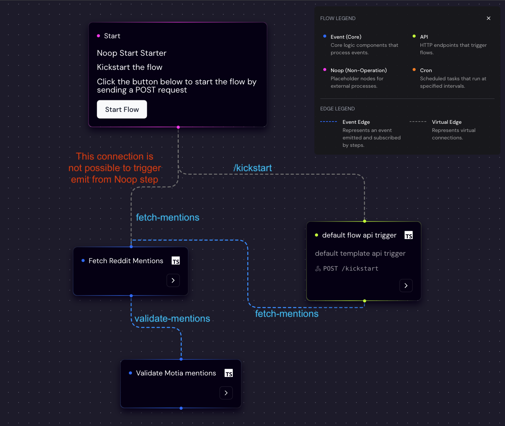

# Reddit keyword tracker

> [!IMPORTANT]  
> Main goal of this showcase is to show the differences among the type of steps.

This showcase is a conceptual showcase of a simple flow of fetching the data from Reddit and analyzing it using OpenAI's API.

## Getting started

1. Clone this repository
1. Enter the folder

   ```sh
   cd examples/keyword-tracker
   ```

1. Install the dependencies

   ```sh
   pnpm install
   ```

1. Create a `.env` file and add your OpenAI API key

   ```sh
   cp .env.example .env # and set the OPENAI_API_KEY variable
   ```

1. Run the Motia Workbench (the runtime)

   ```sh
   pnpm dev
   ```

1. Open the Workbench in your browser

   ```sh
   open http://localhost:3000
   ```

## Showcase flow



## Notes put together during exploration

- Rendered virtual edge even though it is not usable (see the red label in the screenshot above)
- create step `npx motia generate step` command generate handler interface for Typescript. I used a at lest this simple one

  ```ts
  exports.handler = async (
    input: any,
    { traceId, logger, state, emit }: any
  ) => {
    // ...
  };
  ```
- I would add section for attaching the debugger to the docs instead of working with logs => it was fairly simple and easier for development (and it was simple vscode config, not sure how about other IDEs)
- If you log object in the `logget`, the UI stops rendering instead of witger ship, or raise error (uncomment [last line in validateMotiaMentions.step.ts](./steps/validateMotiaMentions.step.ts#L52)) 
