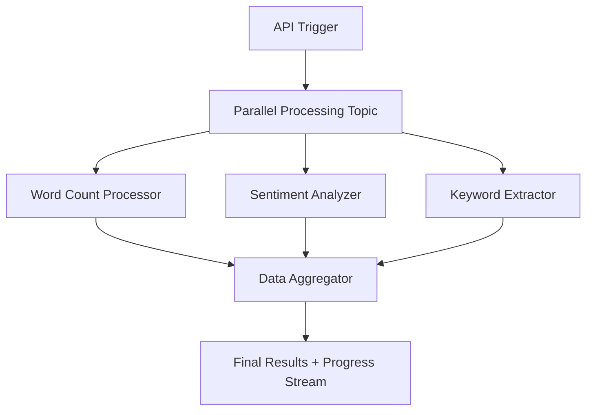

# 🚀 Motia Framework: Parallel Data Processing & Merge Example

A simple example of **parallel execution** and **data aggregation** using [Motia](https://github.com/MotiaDev/motia) - showcasing how complex workflows can be built with elegant simplicity.


## 🎯 Why This Matters

Modern applications require **concurrent processing** to handle data efficiently. Traditional approaches often involve complex threading, queue management, and synchronization logic. **Motia transforms this complexity into simple, declarative workflows** that are:

- ✅ **Type-Safe**: Full TypeScript support with Zod validation
- ✅ **Event-Driven**: Clean pub/sub architecture 
- ✅ **Real-Time**: Live progress tracking with streams
- ✅ **Scalable**: Parallel execution without manual thread management
- ✅ **Maintainable**: Self-documenting workflow steps

## 🏗️ Architecture Overview

This example demonstrates a **text analysis pipeline** that processes input through three concurrent analyzers:



### 🔄 Event Flow

1. **API Trigger** (`/process-data`) receives text input
2. **Parallel Topic** broadcasts to all processors simultaneously
3. **Three Processors** execute concurrently:
   - Word counting (1000ms processing time)
   - Sentiment analysis (1500ms processing time)  
   - Keyword extraction (800ms processing time)
4. **Data Aggregator** merges results as they complete
5. **Progress Stream** provides real-time updates (33% → 66% → 100%)

## 🚀 Quick Start

### Prerequisites
- Node.js 18+
- npm or yarn

### Installation & Setup

```bash
# Clone the repository
git clone https://github.com/MotiaDev/motia-examples.git
cd examples/motia-parallel-execution

# Install dependencies
npm install

# Start the development server
npm run dev
```

### 🧪 Testing the Workflow

1. **Open the Motia Workbench**: http://localhost:3000
2. **Navigate to Endpoints** tab
3. **Test the parallel processing**:

```bash
# Using curl
curl -X POST http://localhost:3000/process-data \
  -H "Content-Type: application/json" \
  -d '{
    "text": "This is a great example of amazing parallel processing with wonderful results and fantastic performance",
    "id": "test-parallel"
  }'
```
  Response includes a `streamId` you can use to watch progress in the Streams panel.

  Example:
  ```json
  { "message": "Parallel processing started", "traceId": "<trace>", "streamId": "test-parallel" }
  ```

4. **Monitor Results**:
   - **Logs Tab**: See all three processors start simultaneously
   - **States Tab**: View aggregated results
    - **Streams Tab**: Watch real-time progress updates using the `streamId` as the group id

## 📁 Project Structure

```
motia-parallel-execution/
├── steps/
│   ├── data-processing-api.step.ts    # API trigger endpoint
│   ├── word-count.step.ts             # Word counting processor
│   ├── sentiment-analysis.step.ts     # Sentiment analysis processor
│   ├── keyword-extraction.step.ts     # Keyword extraction processor
│   ├── data-aggregator.step.ts        # Results aggregation
│   └── processing-progress.stream.ts     # Real-time progress stream
├── types.d.ts                            # TypeScript definitions
└── package.json                          # Dependencies
```

## 🔧 How It Works

### 1. **API Trigger Step**
The workflow starts with an API endpoint that accepts text input and triggers parallel processing:

```typescript
// From 04-data-processing-api.step.ts
export const config: ApiRouteConfig = {
  type: 'api',
  method: 'POST',
  path: '/process-data',
  emits: ['parallel-processing'],  // Broadcasts to all processors
  bodySchema: z.object({ 
    text: z.string().min(1, 'Text content is required'),
    id: z.string().optional()
  })
}
```

### 2. **Parallel Processing Steps**
Each processor subscribes to the same topic for **true parallel execution**:

```typescript
// Pattern used in 05, 06, 07 steps
export const config: EventConfig = {
  type: 'event',
  subscribes: ['parallel-processing'],  // Same topic = parallel execution
  emits: ['processing-result'],         // Results sent to aggregator
  input: z.object({ 
    text: z.string(),
    processingId: z.string()
  })
}
```

**Processing Details:**
- **Word Count** (1000ms): Splits text and counts valid words
- **Sentiment Analysis** (1500ms): Analyzes positive/negative/neutral sentiment
- **Keyword Extraction** (800ms): Extracts top 5 keywords using frequency analysis

### 3. **Real-Time Progress Streaming**
```typescript
// From processing-progress.stream.ts
export const config: StreamConfig = {
  name: 'processingProgress',
  schema: z.object({
    status: z.enum(['started', 'processing', 'completed', 'error']),
    progress: z.number().min(0).max(100),
    results: z.object({
      wordCount: z.number().optional(),
      sentiment: z.string().optional(),
      keywords: z.array(z.string()).optional(),
      summary: z.string().optional()
    })
  }),
  // Default storage enables real-time streaming and socket updates
  baseConfig: { storageType: 'default' }
}
```

### 4. **Intelligent Data Aggregation**
The aggregator waits for all results and merges them:

```typescript
// From 08-data-aggregator.step.ts
const expectedResults = ['wordCount', 'sentiment', 'keywords']
const isComplete = expectedResults.every(key => completedResults.includes(key))

if (isComplete) {
  const summary = `Text analysis complete: ${currentResults.wordCount} words, 
    ${currentResults.sentiment} sentiment, keywords: ${currentResults.keywords.join(', ')}`
}
```

## 🎨 Key Features Demonstrated

### ⚡ **True Parallel Execution**
- Multiple steps subscribe to the same topic
- All processors start **simultaneously**
- No manual thread management required
- **Event-driven coordination**

### 📊 **Real-Time Progress Tracking**
- Stream-based progress updates
- Live status monitoring in workbench
- **33% → 66% → 100%** completion tracking
- State persistence across workflow steps

### 🔄 **Intelligent Data Aggregation**
- Results collected as they complete
- **Completion detection** logic
- Final summary generation
- **Type-safe** result merging

### 🛡️ **Type Safety Throughout**
- **Zod schemas** for input validation
- **TypeScript definitions** for all handlers
- **Compile-time** error detection
- **Runtime** validation

## 🌟 Why Motia is Amazing

### **Before Motia** (Traditional Approach)
```javascript
// Complex threading, queue management, synchronization
const workers = new WorkerPool(3)
const results = await Promise.all([
  workers.submit(wordCountTask),
  workers.submit(sentimentTask), 
  workers.submit(keywordTask)
])
// Manual result merging, error handling, progress tracking...
```

### **With Motia** (Declarative Approach)
```typescript
// Simple event subscription = automatic parallel execution
export const config: EventConfig = {
  subscribes: ['parallel-processing'],  // That's it!
  emits: ['processing-result']
}
```

## 🔍 Example Output

### Input
```json
{
  "text": "This is a great example of amazing parallel processing with wonderful results and fantastic performance"
}
```

### Parallel Processing Logs
```
[10:20:20] Step 05 – Processing word count (processingId: processing-1748947169)
[10:20:20] Step 06 – Processing sentiment analysis (processingId: processing-1748947169)  
[10:20:20] Step 07 – Processing keyword extraction (processingId: processing-1748947169)
[10:20:21] Step 07 – Keyword extraction completed (800ms)
[10:20:21] Step 05 – Word count completed (1000ms)
[10:20:22] Step 06 – Sentiment analysis completed (1500ms)
```

### Final Aggregated Results
```json
{
  "status": "completed",
  "progress": 100,
  "results": {
    "wordCount": 16,
    "sentiment": "positive", 
    "keywords": ["amazing", "wonderful", "fantastic", "great", "example"],
    "summary": "Text analysis complete: 16 words, positive sentiment, top keywords: amazing, wonderful, fantastic, great, example"
  }
}
```

## 🚀 Extending This Example

### Add More Processors
```typescript
// Just create a new step that subscribes to 'parallel-processing'
export const config: EventConfig = {
  name: 'LanguageDetector',
  subscribes: ['parallel-processing'],
  emits: ['processing-result']
}
```

### Custom Aggregation Logic
```typescript
// Modify the aggregator to handle new result types
const expectedResults = ['wordCount', 'sentiment', 'keywords', 'language']
```

### Different Processing Times
```typescript
// Simulate different processing complexities
await new Promise(resolve => setTimeout(resolve, processingTime))
```

## 🤝 Contributing

1. Fork the repository
2. Create your feature branch (`git checkout -b feature/amazing-processor`)
3. Add your parallel processor step
4. Update the aggregator to handle new results
5. Test with the workbench
6. Submit a pull request

## 📚 Learn More

- **Motia Framework**: https://github.com/MotiaDev/motia
- **Documentation**: [Motia Docs](https://www.motia.dev/docs)
- **Examples**: [More Motia Examples](https://github.com/MotiaDev/motia-examples)

## 🎯 Conclusion

This example showcases how **Motia transforms complex parallel processing** into elegant, maintainable workflows. With just a few declarative steps, you get:

- ⚡ **Automatic parallel execution**
- 📊 **Real-time progress tracking** 
- 🔄 **Intelligent data aggregation**
- 🛡️ **Complete type safety**
- 🎨 **Visual workflow monitoring**

**Motia makes the complex simple** - turning what would be hundreds of lines of threading code into clean, declarative workflow steps that are easy to understand, test, and maintain.

---

**Built with ❤️ using [Motia Framework](https://github.com/MotiaDev/motia)**

---

### ❓ Troubleshooting
- If you see an error like "stream is not a function", ensure your stream step uses `StreamConfig` with `baseConfig: { storageType: 'default' }`, then re-run `npm run generate-types` and restart `npm run dev`.
