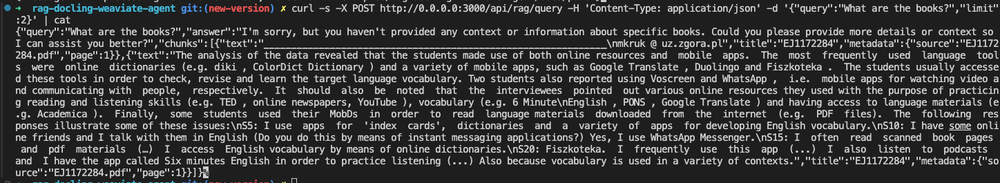

# PDF RAG Agent (Motia + Docling + Weaviate)

This example builds a retrieval‑augmented pipeline: it ingests PDFs, chunks them with Docling, stores the chunks in Weaviate, and answers questions using Motia’s event‑driven workflow.


## Key Features

- PDF document processing and chunking
- Built with [Motia Framework](https://github.com/motiadev/motia) for event-driven Architecture
- Vector storage using [Weaviate](https://weaviate.io/)
- [Docling](https://github.com/docling-project/docling) for PDF parsing and hybrid chunking
- Question answering using RAG pattern
- [OpenAI](https://openai.com/) integration for embeddings and text generation

## Prerequisites

- Node.js 18+
- Python 3.10+
- [Weaviate instance](https://weaviate.io/docs/installation.html)
- [OpenAI API key](https://openai.com/api/)

## Setup

1. Initialize the Node.js and Python dependencies:
```bash
npm install
```

2. Create a `.env` file in the root directory with the following variables:
```env
OPENAI_API_KEY=your_openai_api_key
WEAVIATE_URL=https://<cluster>.weaviate.cloud
WEAVIATE_API_KEY=your_weaviate_api_key
```

## Development

Start the development server:
```bash
npm run dev
```

## Project Structure
```
rag-docling-weaviate-agent/
├── steps/
│   ├── api-steps/          # API endpoints for PDF processing and querying
│   │   ├── api-process-pdfs.step.ts
│   │   └── api-query-rag.step.ts
│   └── event-steps/        # Background processing steps
│       ├── init-weaviate.step.ts
│       ├── load-weaviate.step.ts
│       ├── process-pdfs.step.py
│       └── read-pdfs.step.ts
├── types/               # TypeScript type definitions
```

The project follows a modular structure aligned with Motia Framework conventions:

- `steps/`: Contains all workflow steps
  - `api-steps/`: HTTP endpoints for PDF processing and querying
  - `event-steps/`: Background processing steps for chunking, embedding, and answer generation
- `services/`: Core business logic modules
- `types/`: TypeScript type definitions
- `utils/`: Helper functions and utilities
- `middlewares/`: API request/response middleware

## How it Works

1. **Document Processing**: The system processes the PDF using Docling and HybridChunker to split it into chunks
1. **Vector Storage**: Text chunks are stored in Weaviate with OpenAI text2vec/generative
1. **Query Processing**: User queries are processed using RAG:
   - Query is embedded and similar chunks are retrieved from Weaviate
   - Retrieved context and query are sent to OpenAI for answer generation
   - Response is returned to the user

## API Endpoints

- `POST /api/rag/process-pdfs`: Start processing PDF documents
- `POST /api/rag/query`: Submit questions about the documents

### Example calls
From this directory, the ingestion step accepts relative or absolute folder paths. Both of these work:
```bash
curl -X POST http://localhost:3000/api/rag/process-pdfs \
  -H "Content-Type: application/json" \
  -d '{"folderPath":"docs/pdfs"}'

curl -X POST http://localhost:3000/api/rag/process-pdfs \
  -H "Content-Type: application/json" \
  -d '{"folderPath":"/absolute/path/to/rag-docling-weaviate-agent/docs/pdfs"}'
```

Query after you see batch insert logs:
```bash
curl -X POST http://localhost:3000/api/rag/query \
  -H "Content-Type: application/json" \
  -d '{"query":"What are these pdfs about?","limit":3}'
```



If you paste a repo‑relative path like `examples/rag-docling-weaviate-agent/docs/pdfs` while you are already inside this example, the step automatically normalizes it to avoid ENOENT errors.

## License

MIT
