# Slack Task Manager

<div align="center">
  
  
  
</div>

<div align="center" style="display: flex; justify-content: center; align-items: center; gap: 40px;">
  
  
</div>

## 🔍 Overview

The Slack Task Manager is a powerful Slack bot application that helps teams manage tasks and reminders directly from Slack. Built with TypeScript, this application provides an intuitive way to create, track, and manage tasks through simple slash commands, making team collaboration more efficient and organized.


## ✨ Features

- **Task Management**
  - Create tasks with `/task` command
  - Mark tasks as complete with `/complete` command
  - List all your tasks with `/list` command
  - View task history and status

- **Smart Reminders**
  - Set reminders with `/reminder` command
  - Flexible time formats (hours, minutes, days, weeks)
  - Customizable reminder messages
  - Reminder notifications in channels

- **Real-time Updates**
  - Instant task creation confirmation
  - Immediate status updates
  - Channel-wide notifications
  - User-specific task lists

## 🔄 Workflow

1. **Command Reception**: User sends a slash command in Slack
2. **Token Verification**: Verify request authenticity
3. **Command Processing**: Parse and validate command
4. **Task Management**: Create/update/complete tasks
5. **Reminder Scheduling**: Set and manage reminders
6. **Response Generation**: Send confirmation messages
7. **Notification Dispatch**: Send channel notifications

## 🔧 Implementation Details

### Command Processing
- Token verification using `SLACK_VERIFICATION_TOKEN`
- Command parsing and validation
- Error handling and logging
- Response formatting

### Task Storage
```typescript
{
  id: string;
  text: string;
  user: string;
  channel: string;
  status: 'pending' | 'completed';
  createdAt: string;
}
```

### Technical Components

- **Event System**: Event-driven architecture for command processing
- **Token Verification**: Secure request validation
- **Command Processing**: Robust command handling
- **Storage System**: In-memory task management
- **Notification System**: Real-time updates and reminders

## 🚀 Quick Start

### Prerequisites

- Node.js (v16 or higher)
- pnpm package manager
- Slack workspace with admin access
- ngrok (for local development)
- Slack API credentials

### Environment Setup

1. Clone this repository:
   ```bash
   git clone https://github.com/MotiaDev/motia-examples.git
   cd motia-examples/examples/slack-task-manager
   ```

2. Install dependencies:
   ```bash
   pnpm install
   ```

3. Create `.env` file:
   ```env
   SLACK_VERIFICATION_TOKEN=your_verification_token
   SLACK_BOT_TOKEN=your_bot_token
   ```

4. Start ngrok for local development:
   ```bash
   ngrok http 3000
   ```

5. Start the development server:
   ```bash
   pnpm run dev
   ```

## 🌐 Slack Commands

### Create Task
```
/task Buy groceries
```

### Set Reminder
```
/reminder 1h Call mom
```

### Complete Task
```
/complete task_id
```

### List Tasks
```
/list
```

## How It Works

### Under the Hood: Command Processing

#### 1. Task Creation Flow (`/task`)

```mermaid
sequenceDiagram
    participant User
    participant Slack
    participant App
    participant Storage
    participant Logger

    User->>Slack: /task Buy groceries
    Slack->>App: POST /slack/command
    Note over App: 1. Request received
    App->>Logger: Log request details
    Note over Logger: [INFO] Received Slack command
    App->>App: Verify Slack token
    Note over App: 2. Token verification
    App->>Logger: Log verification status
    Note over Logger: [INFO] Token verification
    App->>Storage: Store task
    Note over Storage: 3. Task stored in memory
    Storage-->>App: Task stored
    App-->>Slack: Task created confirmation
    Slack-->>User: "✅ Task created: Buy groceries"
```


#### 2. Reminder Flow (`/reminder`)


### Detailed Process Flow

#### 1. Request Reception
```typescript
// When a command is received
logger.info('Received Slack command:', {
  headers: req.headers,
  body: req.body
});
```
- Slack sends a POST request to `/slack/command`
- Request includes command, text, user_id, channel_id
- Headers contain verification tokens

#### 2. Token Verification
```typescript
const slackToken = process.env.SLACK_VERIFICATION_TOKEN;
const requestToken = req.headers['x-slack-request-token'] || req.headers['x-slack-signature'];
logger.info('Token verification:', {
  hasSlackToken: !!slackToken,
  requestToken: requestToken
});
```
- Verifies request authenticity
- Checks against environment variables
- Logs verification status

#### 3. Command Processing
```typescript
switch (body.command) {
  case '/task':
    const taskData = {
      topic: 'task_created',
      data: {
        text: body.text,
        user: body.user_id,
        channel: body.channel_id,
        timestamp: new Date().toISOString(),
      }
    };
```
- Parses command type
- Extracts relevant information
- Prepares data structure

#### 4. Storage Operations
```typescript
const tasks: Array<{
  id: string;
  text: string;
  user: string;
  channel: string;
  status: 'pending' | 'completed';
  createdAt: string;
}> = [];
```
- In-memory array storage
- Task structure with metadata
- Status tracking

#### 5. Response Generation
```typescript
return {
  status: 200,
  body: {
    response_type: 'in_channel',
    text: `✅ Task created: ${body.text}`,
  },
};
```
- Formats response
- Sets response type
- Includes emoji indicators

### Logging and Debugging

The application includes comprehensive logging:

1. **Request Logging**
   ```
   [INFO] Received Slack command:
   {
     headers: {...},
     body: {
       command: '/task',
       text: 'Buy groceries',
       user_id: 'U123456',
       channel_id: 'C123456'
     }
   }
   ```

2. **Token Verification**
   ```
   [INFO] Token verification:
   {
     hasSlackToken: true,
     requestToken: '...'
   }
   ```

3. **Error Handling**
   ```
   [ERROR] Error processing Slack command:
   {
     message: 'Invalid token',
     stack: '...'
   }
   ```

## 🧪 Testing

### Local Development Testing

1. Start your development server:
   ```bash
   pnpm run dev
   ```

2. Keep ngrok running:
   ```bash
   ngrok http 3000
   ```

3. Try the commands in Slack:
   ```
   /task Test task
   /reminder 1h Test reminder
   ```

### Troubleshooting

1. **ngrok URL changes**: Update Request URLs in Slack app settings
2. **Connection issues**: Check server and ngrok status
3. **Command not working**: Check server logs and environment variables

## 🔮 Future Improvements

### Technical Enhancements
- [ ] MongoDB integration for persistent storage
- [ ] PostgreSQL support
- [ ] Data migration tools
- [ ] Backup system

### Feature Expansions
- [ ] Task categories and tags
- [ ] Recurring reminders
- [ ] Team member assignments
- [ ] Task priorities
- [ ] Due dates
- [ ] Task dependencies

### UI Improvements
- [ ] Interactive buttons
- [ ] Rich message formatting
- [ ] Status updates
- [ ] Progress tracking
- [ ] Custom emojis

### Security Enhancements
- [ ] Slack signature verification
- [ ] Rate limiting
- [ ] User authentication
- [ ] Audit logging

### Testing Infrastructure
- [ ] Unit tests
- [ ] Integration tests
- [ ] E2E tests
- [ ] CI/CD pipeline
- [ ] Performance testing

## 🙏 Acknowledgements

- [Slack API](https://api.slack.com/) for the powerful bot framework
- [TypeScript](https://www.typescriptlang.org/) for type safety
- [ngrok](https://ngrok.com/) for local development

---

<div align="center">
  <p>Built with ❤️ by </p>
  <p>
    <a href="https://github.com/swarna1101">Swarna</a>
  </p>
</div>


